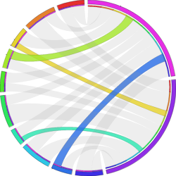

# Research Data Management Program – Competitive Funding Call 1
## Statement of Work

## Name of project:

CanDIG CHORD: Canadian Health Omics Repository, Distributed

## Institution / Organization (Lead Contractor):

McGill University

Project Summary
===============

Tackling the &ldquo;wicked problems&rdquo; of cancer and rare
diseases against the already complex landscape of human biology
requires health researchers to have access to as much health data
as possible in order to see connections and test hypotheses.
Genomics, and emerging related molecular data types refered to
broadly as 'omics, offer important new windows into understanding
human health.  A torrent of such data is already being produced at
sites across Canada, driven currently by research, but with clinical
'omics data generation soon to dominate as these molecular tests
begin to enter standard care.

In Canada, healthcare and healthcare data is an area of exclusive
provincial jurisdiction.  Diffences between provincial privacy
regulations for protection of health data makes bringing data
together centrally for national-scale analysis difficult, even when
those policies and patient consents would readily allow researchers
to peform joint analyses of those data sets.  But understanding
health problems that affect Canada as a whole, and taking advantage
of the promise of precision medicine, will require Canadian health
researchers to be able to analyze Canada-wide sets of data.

CanDIG (http://distributedgenomics.ca) is a national project to
allow federated analysis of distributed human health genomics data,
while allowing data stewards complete, auditable control over
data access.  CanDIG supports the discovery, querying, and analysis
of distributed data sets by sending analyses to the data, where
local data stewards can apply their governance and access policies.
CanDIG already supports two national-scale clinical research projects;
PROFYLE, a project for precision pediatric oncology, and the TF4CN
project for basket-style cancer clinical trials. This support is built on 
the storage and federated querying of clinical data using standard
ontologies, raw genomic data (reads), processed genomic data
(variants), and is integrating support for the running of long-running
analysis pipelines on those data types.

As a driver project for the Global Alliance for Genomics and Health
(GA4GH; http://genomicsandhealth.org), CanDIG participates on the
international stage in the development of data standards,
interoperability standards (APIs), policies, and tools for
standards-based responsible omics data use for human health.  CanDIG
brings distinctively Canadian insight into federation to the GA4GH,
and it federated approach builds on the investments Canada has made
in digital research infrastucture, both the National Research and
Education Network, and computational and local storage infrastructure
at its participating sites.

CHORD allows the technologies and services being built by CanDIG
and its international partners to be made available to the Candian
health research community more broadly. 

In the data publishing activity, a key consideration is the wide
variety of possible data sources that researchers will have;
interoperability will require automated quality control and
normalization of omics data upon upload, before ingestion into the
system.  The CanDIG project will accelerate its development of a
scalable genomics data back-end which supports automated processing
tasks when data is stored, and CHORD will develop routines 
for quality control and normalization of reads and variants.  CHORD
will also develop upload and download services,
upload portal which will include clinical, phenotypic, and metadata
entry for the uploaded data, and the generation of permanent
accesssion identifiers for uploaded information.

The broader research community will also bring with them a wider
range of data _types_.  In the extended health data activity, CHORD
will develop new services that directly support bulk RNA expression
data and emerging single cell RNA data standards. Within the GA4GH
Driver project community, CanDIG has the opportunity to interact
and collaborate with 14 international genomic data projects including
the Human Cell Atlas; this will inform CHORD's single cell data work. 
CHORD development will follow a modern, microservices,
&ldquo;API-first&rdquo; approach, and to support the end-to-end
testing of the multiple services that will comprise CHORD, the
CanDIG project will build an integrated testing harness to ensure
that these multiple services can be tested together in an automated
and routine fashion.

Researchers will also have diverse requirements for authorization.
In the authorized privacy preserving reuse activity, CanDIG will
complete and deploy its prototype authorization engine for
consistent, policy-driven access across services; and CHORD will build
on CanDIGs work with differential privacy for data mining, and the
GA4GH's emerging Data Use Ontology standard for computer-readable
reuse policy.

Finally, the findability and access activity will see the development
of a data discovery service which includes who to contact for
authorization for data that is not available to a researcher, and
extending authentication beyond the original CanDIG sites to include
the Canadian Access Federation.

Lead Contractor
===============

  **Lead Contractor**
  ----------------------------------- --------------------------------------------------------------
  Organization Name                   
  Organization Type                   University or College
  Anticipated role/s in the project   

  **Principal Investigator**
  ------------------------------------- --
  Name                                  
  Title                                 
  Faculty/Department/Division/Program   
  Phone                                 
  Email                                 

Append a short bio (maximum one \[1\] page) summarizing relevant
experience, expertise and qualifications.

  **Co-Principal Investigator**
  ---------------------------------------------------- --
  Name                                                 
  Title                                                
  Faculty/Department/Division/Program                  
  Phone                                                
  Email                                                

  **Co-Principal Investigator**
  ---------------------------------------------------- --
  Name                                                 
  Title                                                
  Faculty/Department/Division/Program                  
  Phone                                                
  Email                                                

Append a short bio (maximum one \[1\] page) summarizing relevant
experience, expertise and qualifications.

  ------------------------------------------------------------------------------------
  **Project Manager**

  --------------------------------------------------------------------------------- --
  Name                                                                              
  Title                                                                             
  Faculty/Department/Division/Program                                               
  Phone                                                                             
  Email                                                                             

Append a short bio (maximum one \[1\] page) summarizing relevant
experience, expertise and qualifications.

  ---------------------------------------------------------------------------------------------
  **Lead Software Developer**
  
  If you do not currently have a Lead Software Developer, please leave this section blank.
  ------------------------------------------------------------------------------------------ --
  Name                                                                                       
  Title                                                                                      
  Faculty/Department/Division/Program                                                        
  Phone                                                                                      
  Email                                                                                      

Append a short bio (maximum one \[1\] page) summarizing relevant
experience, expertise and qualifications.

Participants 
=============

**Note:**

-   A Participant will incur eligible costs that will be claimed through
    the Lead Contractor.

-   If you have multiple participants, please fill out the table below
    for each one.

  **Funded Participant \#**
  -------------------------------------------------- --------------------------------------------------------------
  Organization Name                                  
  Faculty/Department/Division/Program                
  Organization Type                                  &lt;For-profit / Not-for-profit / University or College &gt;
  Address                                            
  Province                                           
  Anticipated role/s and rationale for involvement   
