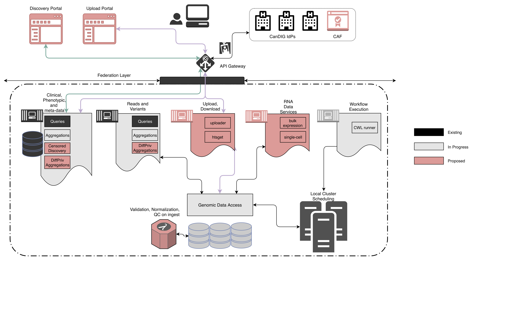
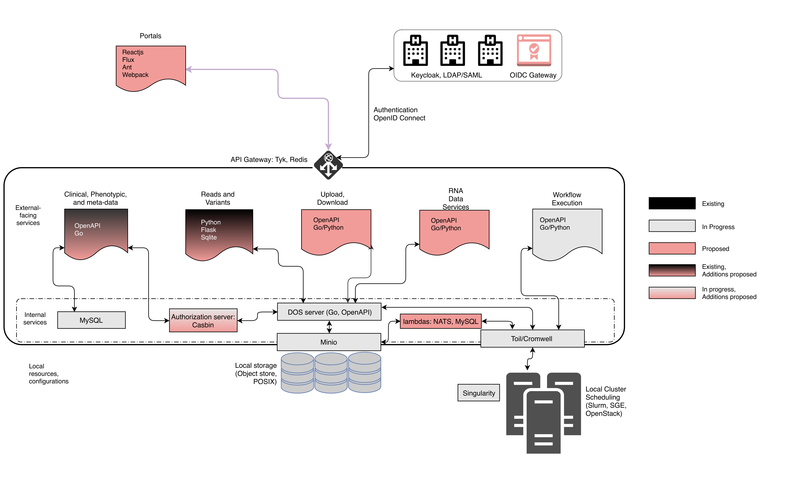

Scoring Criteria:
=================

> 1.  **What is the extent to which the project makes use of or
>     contributes to digital research infrastructure?**

> 2.  **What is the extent to which the project creates or contributes to
>     a national data service?**

> 3.  **What is the extent to which the project supports FAIR principles?**

The CHORD project aims to improve the FAIRness of the services
offered by CanDIG in two broad ways.

First, CHORD will allow broader adoption of the data and computation
services offered by CanDIG, beyond large national projects, by
making it easier to set up new CHORD sites to support data publishing
and re-use in the broader genomics research community.

In the second, CHORD services will strengthen the FAIRness of the
current CanDIG suite of services in specific ways.

While findability of data through CanDIG services is very strong,
with rich metadata indexed in a searchable resource, with metadata
specifying the data identifier (F2,F3, and F4), identifiers are not
now guaranteed to be persistent; CHORD will improve the findability
and citability of Canadian genomic data by allowing it to be published
with a globally unique and persistent identifier (principle F1).

Availability for analysis has been a guiding principle of
CanDIG services (via open, authorized protocals, A1.1, A1.2),
but accessibility (including, for instance, for download) _per se_ had
not been a goal; similarly, data that was not available due whether
due to loss or lack of authorization meant that the metadata was
no longer visible.  CHORD will allow data downloads when so authorized
(A1) and the &ldquo;Censored Discovery&rdquo; will always allow
some degree of accessiblity of metadata (A2).

Interoperability of data betwen similar projects with CanDIG services
is good, with recommended ontologies (I1, I2) and qualified references
between metadata items or data items (I3), and reuse was enabled by
strong community standards (R1.3), provenance information (R1.2), and 
accurate and relevant attributes (R1).  Reuse however remains somewhat
limited by only recent emergence of standards for describing what 
data may be used for (R1.1); data may be consented for reuse only for certain
purposes.  CHORD will implement Data Use Ontologies such as the 
GA4GH [Automatable Discovery and Access Matrix (ADA-M)](https://github.com/ga4gh/ADA-M)
to allow data to be searched by allowable use.

> 4.  **What is the extent to which the project integrates with
>     international digital research infrastructure?**

> In addition to answering the questions above, applicants will also be
> scored on the following criteria:
> 
> 1.  **Completeness/quality/sustainability of the project/design.**
> 
> 2.  **Overall assessment of the project.**

System Architecture 
====================

> Insert a system architecture diagram outlining the hardware and software components of the proposed project,
> clearly differentiating between parts of the system that already exist and those parts that will have to be added/modified.
> Show how parts would interact with users and other resources, as appropriate.
> 
> Note: Your project should be designed with reuse and extendibility in mind.
> 
> Max. 2 pages

Software Architecture
=====================

> Insert a high-level architecture diagram of the major functional components of the proposed software,
> illustrating how they would interact with each other, and clearly differentiating between components
> that already exist and those that will have to be added or modified. 
>
> Max. 2 pages

Software Development Summary
============================

> Please provide an overview of the proposed software development.
> Your summary should:
>
> Identify existing software that will be used.
> Describe any modifications that will have to be made to the existing software.
> Describe any new software that will have to be developed.
>
> Max 750 words

Future Customization and/or Extension of Functionality
======================================================

> Describe how your software design allows for future customization and/or extension of functionality.
>
> Max. 500 words.

